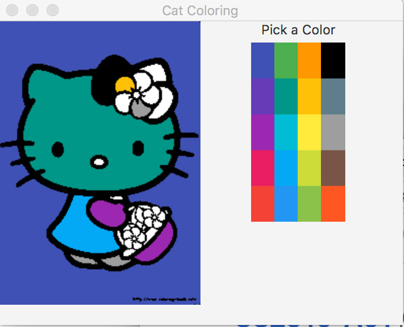

# CS2910-A01
Assignment 01 

Implement a solution to the text E15.22 to allow a user to Flood Fill an area of a image.

Goal of the assignment:

video demonstration:
https://youtu.be/cP4iDscl5Io

For this task you are given the Main GUI portions of the code, however you must implement the following tasks:

1. Read the image found in src/Images/cat.txt into a workable format in your program. This image contains the pixel values for the uncolored cat image. That is it contains white and black pixels in an integer format. 

Note: you do not need to use a GUI image format - a 2d array is fine - or in my solution I implement a small wrapper class around a 2D image. You will be required to pass a 2D array to the GUI portion of the program and it will convert that into a picture on the screen.

2. Implement *setPen* method in the Controller class to allow the user to change the color of the pen they are coloring with

3. Implement the floodFill method in the controller class to implement the flood fill algorithm from E15.22 (Note below this is slightly modified from the text). This should be very similar to the Maze example from Chapter 15. 

4. If you in the least remove the println statements in the setPen and floodFill methods and check your code (push) back into your repository by the Wednesday (midnight) before the Friday midnight deadline) You will receive 1 point. If you happen to make further progress on the assignment than removing those print statements, that's even better. 

The algorithm is as follows:

+ Given a starting row and col
+ if it is an empty pixel (white pixel) push the (row, column) onto the Stack

+ repeat until the stack is empty:

  + pop the top (row, column) off the stack
  + color it the desired color
  + push any empty neighbouring pixels (row, column) from north, south, east and west neighbours onto the stack

+ end of algorithm 

Note: be careful to only push an empty neighbour onto the stack so that you don't end up in an endless loop pushing and popping pixels that have already been colored, and also watch that a neighbour isn't off the edge of the image. It is left to you to best represent a (row, column) pixel.

You do not have to modify Main.java this controls the GUI portions which are provided for you. You may add addition classes and methods as you like. 

You should clone this repository and then open the cloned folder directly with IntelliJ (as in our previous demo). You can do all of this directly from the IntelliJ (clone repository interface). 

Submit all work before the deadline to your Github repository. 

Deadline: 

First code check-in: on-or before Wednesday September 26 (midnight)
Completed Assignment: Friday September 28 (midnight)

Grade Rubric:

 Item | Points | 
---|---
First code check-in | 1 point |
Coding Style | 2 points |
Design of solution | 3 points |
Functionality | 4 points |

total: 10 points

Notes:
* Coding Style: member variables start with m then camel case and are well chosen names, indentation, comments at top of methods, etc
* Design of solution - are your methods reasonably short (no methods over 100 lines should be required in this assignment), did you add methods or classes where appropriate. Did you use local and member variables appropriately, etc
* Functionality: does the program execute the expected outcomes as above: 1,2,3

